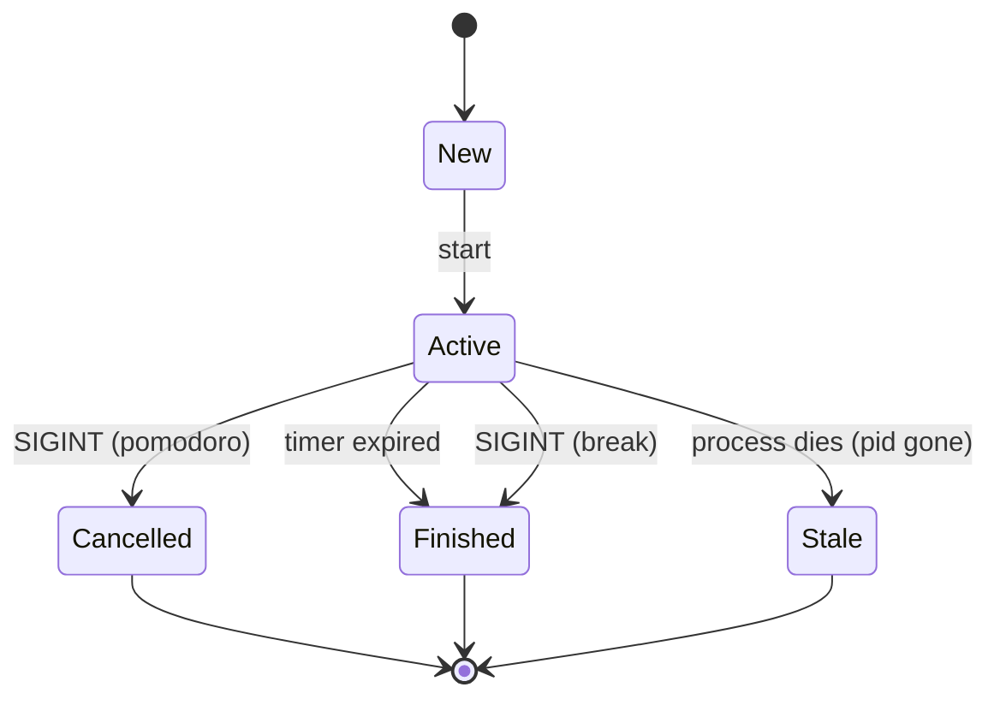

# Rustomato — Architecture & Conventions

## Overview

Rustomato is a command-line Pomodoro timer written in Rust. It manages
pomodori and breaks as stateful **schedulables** persisted in a local
SQLite database, runs user-provided **hooks** at lifecycle transitions,
and provides reports on productivity patterns.

---

## Crate Structure

| Module | Responsibility |
|---|---|
| `lib.rs` | Domain model (`Schedulable`, `Kind`, `Status`, `Annotation`, `InterruptionKind`, `InterruptLog`), timestamp parsing, `pid_is_alive` / `kill_process` helpers |
| `main.rs` | CLI entry point — clap argument parsing, dispatches to `Scheduler`, formats output |
| `scheduling.rs` | `Scheduler` — orchestrates the lifecycle of a schedulable (start → timer → finish/cancel), Ctrl-C handling, force-cancel |
| `persistence.rs` | `Repository` — SQLite read/write, constraint enforcement, active-entry queries |
| `hooks.rs` | Hook discovery, execution, timeout, environment construction |
| `report.rs` | Day/week/month/last-day/interruptions report generation |
| `migration.rs` | Schema migration runner (V1–V7) |

---

## Domain Model

### `Schedulable` — a single pomodoro or break session

```
pid          u32        OS process ID (non-zero while running)
kind         Kind       Pomodoro | Break
uuid         SqlUuid    Unique ID (UUIDv4, stored as hex string without dashes)
duration     i64        Minutes
started_at   i64        Unix timestamp when started
finished_at  i64        0 until finished
cancelled_at i64        0 until cancelled
interruptions i64       Count of interrupts recorded
```

### `Status` — derived state of a `Schedulable`



`Status` is computed on the fly from the timestamp fields and PID liveness
(`pid_is_alive`). It is never stored.

### `Kind`

- **Pomodoro**: Can be interrupted (counter incremented, keeps running), can
  be cancelled (Ctrl-C → `cancelled_at`).
- **Break**: Cannot be interrupted. Ctrl-C finishes it (`finished_at`) rather
  than cancelling.

---

## Persistence

### Database

SQLite via `rusqlite`. Location defaults to `$RUSTOMATO_ROOT/data.db`, or
overridden via `RUSTOMATO_DATABASE_URL`.

### Key invariants (enforced by SQLite triggers & unique index)

1. **Singular PID** (`singularity_pid` trigger) — at most one row may have a
   non-NULL `pid` at any time. This is the active-or-stale entry.
2. **Singular active state** (`singularity_state` index) — at most one row may
   have `started_at IS NOT NULL AND finished_at IS NULL AND cancelled_at IS NULL`.
3. **No overlapping time ranges** (`check_no_overlap` trigger) — the
   `[started_at, COALESCE(finished_at, cancelled_at, infinity))` interval of
   any new row must not overlap with an existing row.
4. **Domain constraints** (CHECK clauses on `schedulables_new`):
   - `duration` > 0 and ≤ 480
   - `interruptions` ≥ 0
   - `pid` ≥ 0
   - `kind` is `'pomodoro'` or `'break'`
   - State consistency: exactly one of finished/cancelled is set when
     transitioning out of active, and the timestamp must be ≥ `started_at`.

### Migrations

Named `V1__...` through `V7__...` in `migrations/`. Applied automatically
on startup in order. Each runs in a transaction and is recorded in the
`_migrations` table. Foreign keys are temporarily disabled during migration
(to allow V6's table rebuild), then re-enabled.

### Repository pattern

`Repository` wraps `rusqlite::Connection` and exposes typed methods:

- `active() -> Option<Schedulable>` — finds the row with a non-NULL pid,
  delegates to `find_by_uuid`.
- `save(&Schedulable) -> Schedulable` — dispatches on `Status`:
  - `Active | Stale` → INSERT (fails with `AlreadyRunning(pid)` if
    `singularity_pid` trigger fires).
  - `Cancelled → UPDATE ... SET pid = NULL, cancelled_at = ?`
  - `Finished` → UPDATE ... SET pid = NULL, finished_at = ?`
  - `New` → error (not started yet).
- `save_external_finished(&Schedulable)` — INSERT with `pid = NULL` and
  `finished_at` set. Used by `rustomato pomodoro log`. Checks Rule #1.

---

## Scheduling (Scheduler)

### Lifecycle of `scheduler.run(schedulable, force)`

1. **Force-cancel** (if `force == true`):
   - Query `repo.active()`. If an active schedulable exists:
     - Kill its PID if still alive (SIGTERM → 500ms → SIGKILL).
     - Pomodoro → `BeforeCancelPomodoro` hook, set `cancelled_at`, save.
     - Break → `BeforeFinishBreak` hook, set `finished_at`, save.
     - After-hooks run after save.
2. **Before-start hook** — `BeforeStartPomodoro` or `BeforeStartBreak`.
   Non-zero exit aborts the operation.
3. **INSERT into DB** — `repo.save()` writes the new active row. If it fails
   with `AlreadyRunning(pid)`, the error is propagated to the caller (this
   should not happen if force was used, but covers the case where no force
   was requested).
4. **After-start hook** — failure is non-fatal (logged if verbose).
5. **Timer loop** — spawned thread with a `ProgressBar`. Polls every 25ms:
   - Timer expired → send `false` on channel.
   - `CTRLC_PRESSED` atomic flag → send `true` on channel.
6. **Finish/Cancel** — depending on kind and whether Ctrl-C was pressed:
   - Pomodoro + Ctrl-C → cancel (`cancelled_at`, before/after hooks).
   - Pomodoro + timeout → finish (`finished_at`, before/after hooks).
   - Break (any exit) → finish (before/after hooks; Ctrl-C does NOT cancel
     a break).

### Ctrl-C handling

A single `ctrlc` handler is installed once (via `Once`) for the process
lifetime. It sets an `AtomicBool` which the timer thread polls. This avoids
re-registering handlers and keeps the signal-safe code minimal.

### `--force` flag

Present on both `pomodoro start` and `break start`. When used:

1. The currently active schedulable's process is killed if alive.
2. Its DB entry is closed out (cancelled for pomodoro, finished for break).
3. The hooks for that close-out are run.
4. A new schedulable starts normally.

This addresses the stale-PID problem: if the process died without cleaning
up, `--force` clears the stale entry so a new one can be created.

---

## Hook System

### Events

18 events total, following the pattern `{Before,After}-{Action}-{Kind}`:

| Event | Can abort? |
|---|---|
| BeforeStartPomodoro, BeforeStartBreak | yes |
| BeforeFinishPomodoro, BeforeFinishBreak | yes |
| BeforeCancelPomodoro | yes |
| BeforeInterruptPomodoro | yes |
| BeforeLogPomodoro | yes |
| BeforeAnnotatePomodoro, BeforeAnnotateBreak | yes |
| _After-* variants of all above_ | **no** (failure logged only) |

### Hook context (`HookContext`)

Constructed from a `Schedulable` plus optional fields (`interrupt_kind`,
`annotation`). Passed to hooks as:

- **`$1`** — hook filename (e.g. `before-start-pomodoro`).
- **Environment variables** — `RUSTOMATO_ROOT`, `RUSTOMATO_HOOK`,
  `RUSTOMATO_KIND`, `RUSTOMATO_UUID`, `RUSTOMATO_DURATION`,
  `RUSTOMATO_STARTED_AT`, `RUSTOMATO_FINISHED_AT`,
  `RUSTOMATO_CANCELLED_AT`, `RUSTOMATO_INTERRUPT_KIND`,
  `RUSTOMATO_INTERRUPTIONS`, `RUSTOMATO_ANNOTATION`.

### Execution

- Hook path: `$RUSTOMATO_ROOT/hooks/<event-filename>`.
- If file does **not exist** → skip (logged in verbose).
- If file is **not executable** → skip (logged in verbose).
- If `--no-hooks` was passed → skip all.
- Hook is spawned via `Command::new(path)`. The parent polls `try_wait()`
  every 50ms until either the hook exits or the **timeout** (default 3s,
  configurable via `RUSTOMATO_HOOK_TIMEOUT` ms) is reached.
- On timeout → `SIGKILL`, then `wait()` to reap.
- Non-zero exit from a `before-*` hook → `SchedulingError::HookRejected`.

### `init` command

Creates sample non-executable hook scripts for all events. They exit 0.
The user must `chmod +x` hooks they want to enable — this prevents accidental
activation and keeps noise low.

---

## CLI Structure

Uses `clap` with derive macros.

```
rustomato
  [--verbose] [--no-hooks] [--version]
  init
  status
  journal
  pomodoro
    start    [--duration MIN] [--force]
    interrupt [--kind internal|external]
    annotate [TEXT...]
    log      [--started-at TS] [--finished-at TS] [--duration MIN]
    cancel
  break
    start    [--duration MIN] [--force]
    annotate [TEXT...]
    cancel
  report
    day    [--date YYYY-MM-DD]
    week   [--date YYYY-MM-DD]
    month  [--date YYYY-MM|YYYY-MM-DD] [--months N]
    last   [--date YYYY-MM-DD] [--days N]
    interruptions [--date YYYY-MM-DD] [--days N]
  completions <SHELL>
```

### Output conventions

- **stdout**: machine-readable primary output (status, journal, reports).
- **stderr**: diagnostic messages, hook output, progress bar, errors.
- Exit code 0 = success (for pomodoro: finished).
- Exit code 1 = error or cancelled (pomodoro Ctrl-C'd).
- Error messages follow the pattern `Error: <description>.`

---

## Process Lifecycle

1. Each `pomodoro start` / `break start` spawns a `rustomato` process that
   blocks until the timer expires or Ctrl-C is pressed.
2. The process writes its own `pid` into the `schedulables` table on start.
3. When the timer expires or Ctrl-C is pressed, the process updates its own
   DB entry (clearing the pid, setting finished_at or cancelled_at).
4. If the process crashes or is `SIGKILL`'d, the DB retains a stale entry
   (pid non-NULL, no finished/cancelled timestamp). This is the **Stale**
   status recognized by `pid_is_alive()`.
5. `--force` resolves stale entries by killing the process (if alive) and
   closing out the DB row before starting a new one.

`pid_is_alive` uses POSIX `kill(pid, 0)` (cross-platform on Unix).
`kill_process` sends SIGTERM, waits 500ms, then SIGKILL if still alive.

---

## Testing Strategy

Three test suites, all run by `cargo test`:

| Suite | File | Scope | Pattern |
|---|---|---|---|
| **Unit** (in `lib.rs`) | `src/hooks.rs` | Hook execution logic | Pure function tests with `tempfile` temp dirs, `assert_matches!` |
| **Integration** | `tests/integration_tests.rs` | `Repository` (DB) | In-memory SQLite (`file::memory:`), direct `Repository` calls |
| **Hook Integration** | `tests/hooks_integration_tests.rs` | `Scheduler` with hooks | In-memory DB + `tempfile` dir for hook scripts, uses `Scheduler::new` |
| **Acceptance** | `tests/acceptance_tests.rs` | Full binary (CLI) | `assert_cmd::Command::cargo_bin`, temp dir as `RUSTOMATO_ROOT`, `predicates` for stdout/stderr assertions |

### Guidelines

- All tests run with an **in-memory SQLite database** (`file::memory:`) unless
  testing file-based features.
- Acceptance tests use `env_remove("RUSTOMATO_DATABASE_URL")` to prevent the
  host environment from leaking into the test.
- Tests that modify the DB always use a fresh in-memory DB — state never
  leaks between tests.
- Hook tests write hook scripts to `tempdir` paths and set executable bits
  explicitly.
- The `TEST_HOOK_TIMEOUT` thread-local is used in tests to avoid waiting the
  full 3-second default timeout.

---

## Design Decisions & Invariants

### Rule #1

There must never be more than one pomodoro XOR break active at any time.
Enforced both at the DB level (triggers) and in the scheduler.

### Pomodoro vs. Break asymmetry

- Breaks cannot be interrupted — `rustomato pomodoro interrupt` while a break
  is active falls back to the most recently finished pomodoro.
- Ctrl-C during a break finishes it (not cancels it), because breaks should
  always complete.
- `--force` respects this asymmetry: force-cancelling an active pomodoro runs
  cancel hooks; force-finishing an active break runs finish hooks.

### `--force` and process lifecycle

`--force` was added because stale entries (process died without cleaning up)
prevented starting new pomodori. The error message had always mentioned
`--force`, but the flag was only defined on `break start` and never wired
through. The fix made the flag operational on both commands and added process
termination (SIGTERM → SIGKILL escalation) so that `--force` works even when
the existing process is genuinely alive.

### Hooks are opt-in

Hook files without the executable bit are silently skipped. This default
prevents the sample scripts (created by `rustomato init`) from executing.
Users explicitly `chmod +x` hooks they want.

### After-hook failures are warnings

`after-*` hooks cannot abort the operation — the transition has already
persisted. Failures are logged to stderr (only in verbose mode) but do not
change the exit code or the DB state.

### `SchedulingError::AlreadyRunning` message

The error mentions `--force` so users know the flag exists to override the
check.

# Meta

* Interview me about important decisions.
* Update this document whenever changes are made to the project.
* Run `pre-commit run --all-files` as a signal whether changes would be accepted.
* Format commit messages using the [conventional commits](https://www.conventionalcommits.org/en/v1.0.0/) specification. Be concise and descriptive and focus primarily on the why, not the what of the commit.
