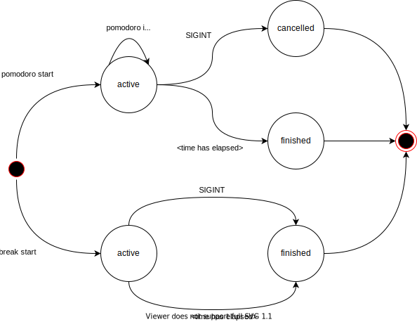

I am learning Rust by implementing a simple [Pomodoro](https://en.wikipedia.org/wiki/Pomodoro_Technique) timer.

# Usage

```command
$ rustomato pomodoro [start]   # Starts a new Pomodoro. Auto-finishes the currently active break if there is one.
$ rustomato pomodoro annotate  # Annotates a¹ Pomodoro.
$ rustomato pomodoro interrupt # Mark a¹ Pomodoro as interrupted.
$ rustomato pomodoro log       # Log a previously finished pomodoro.
$ rustomato break [start]      # Starts a break. Auto-finishes the currently active Pomodoro if there is one.
```
[1] the running, if there is one, or the most recently completed, or the given

`pomodoro` and `break` will block until the time is over. If the command is interrupted with Control-C (`SIGINT`), the currently running Pomodoro is cancelled immediately. If a break is currently running, it is finished.

The possible application states are valid for an instance of the database (as pointed to by `$RUSTOMATO_DATABASE_URL`, which defaults to `$RUSTOMATO_ROOT/data.db`):

  

The default for `$RUSTOMATO_ROOT` is `$HOME/.rustomato`.

## Hooks

> WIP - look at https://github.com/crate-ci/cargo-release/blob/master/src/cmd.rs for an example

Until we have them, here is how to use notifications:

```command
$ rustomato pomodoro start && terminal-notifier -message "Pomodoro is over" -title rustomato -sound glass -group rustomato || terminal-notifier -message "Pomodoro cancelled" -title rustomato -sound glass -group rustomato
```

If you prefer tmux:

```command
$ rustomato pomodoro start && tmux display-message "Pomodoro is over" || tmux display-message "Pomodoro cancelled"
```

Or, on a Mac:

```command
$ rustomato pomodoro start && say "Pomodoro is over" || say "Pomodoro cancelled"
```

# Installation

### Homebrew

```sh
brew install suhlig/tap/rustomato
```

This formula automatically installs shell completions for bash, zsh, and fish.

### Manual

| File | Architecture | Typical Hardware |
|---|---|---|
| `rustomato-linux-amd64.tar.gz` | x86_64 | Desktop PCs, laptops |
| `rustomato-linux-arm64.tar.gz` | ARM 64-bit | Raspberry Pi 3/4/5 (64-bit OS) |
| `rustomato-linux-armv7.tar.gz` | ARM 32-bit | Raspberry Pi 2/3/4/5 (32-bit OS) |
| `rustomato-darwin-amd64.tar.gz` | x86_64 | Intel Macs |
| `rustomato-darwin-arm64.tar.gz` | ARM 64-bit | Apple Silicon Macs |

**Linux**

```sh
arch=$(uname -m | sed 's/x86_64/amd64/;s/aarch64/arm64/;s/armv7l/armv7/') && curl -sL "https://github.com/suhlig/rustomato/releases/latest/download/rustomato-linux-${arch}.tar.gz" | tar xz && sudo mv rustomato /usr/local/bin
```

# Release

## Releasing

> Requires [git-cliff](https://git-cliff.org) (e.g. `brew install git-cliff`) and [cargo-release](https://github.com/crate-ci/cargo-release) (`cargo install cargo-release`)

Cut a new release with a single command:

```sh
cargo release patch   # or `minor`, or `major`
```

This will:
- Choose the next version by bumping the current one (`patch` → `0.0.11`, `minor` → `0.1.0`, …)
- Run `git cliff` to prepend the new changelog entry to `CHANGELOG.md`
- Bump the version in `Cargo.toml`
- Commit both files together
- Create a git tag (e.g. `v0.0.11`)
- Push the commit and tag to GitHub, where `release.yml` builds and publishes the artifacts

To preview without making changes, add `--dry-run`:

```sh
cargo release patch --dry-run
```

# Development

* Install and update rust with `rustup`
* Run tests with `cargo test`
  - use `cargo watch -x test` for fast iteration
  - install the plugin with `cargo install cargo-watch`
* Run the app: `cargo run -- pomodoro`
* Run `pre-commit install` to install the pre-commit hook

# TODO

* Hooks (incl. env vars; do some research)
* Auto-update dependencies via PRs
* `stats` command
* `--force`
* `rustomato pomodoro annotate [WORDS]` adds an annotation to
  - the currently running `rustomato` process,
  - if no process or a break is currently running, amend the most recent pomodoro, or the one given with `--pomodoro UUID`
  - needs `annotations` table, joined onto `schedulables`
  - if no `WORDS` are given, they are taked from `STDIN`
* `rustomato pomodoro interrupt --external | --internal` marks the currently running Pomodoro as interrupted
  - technically, an interrupt is an annotation that is of kind `external-interrupt` or `internal-interrupt`
* Show progress bar only when attached to a terminal
