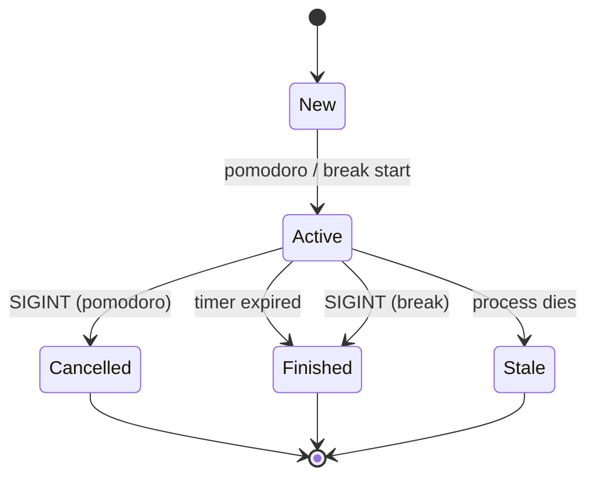

Simple [Pomodoro](https://en.wikipedia.org/wiki/Pomodoro_Technique) timer written in Rust

# Usage

```command
$ rustomato pomodoro start           # Starts a new Pomodoro.
$ rustomato pomodoro interrupt       # Records an interruption on the active (or most recently finished) Pomodoro.
$ rustomato pomodoro annotate <text> # Annotates the active, or the most recently completed, Pomodoro with the given text.
$ rustomato pomodoro log             # Log an externally completed Pomodoro.
$ rustomato break start              # Starts a Break.
```

`pomodoro` and `break` will block until the time is over. If the command is interrupted with Control-C (`SIGINT`), the currently running Pomodoro is cancelled immediately. If a Break is currently running, it is finished.

# Rules

1. There must never be more than one pomodoro [XOR](http://en.wikipedia.org/wiki/Xor) break at any given time.

  This is scoped to an instance of the database (as pointed to by `$RUSTOMATO_DATABASE_URL`). The enforcement happens at the database level via a trigger that rejects overlapping time ranges, and at the application level in the scheduler.

1. No action can ever refer to the future.

   When a bare `HH:MM` is given as a timestamp, it is interpreted as **today at that time** if it is in the past or right now, or **yesterday at that time** if the wall-clock time is in the future.

# State Transitions


```mermaid
stateDiagram-v2
    [*] --> New
    New --> Active : pomodoro / break start
    Active --> Finished : timer expired
    Active --> Cancelled : SIGINT (pomodoro)
    Active --> Finished : SIGINT (break)
    Active --> Stale : process dies
    Cancelled --> [*]
    Finished --> [*]
    Stale --> [*]
```

The possible application states are valid for an instance of the database (as pointed to by `$RUSTOMATO_DATABASE_URL`, which defaults to `$RUSTOMATO_ROOT/data.db`). The default for `$RUSTOMATO_ROOT` is `$HOME/.rustomato`.

The key difference between a pomodoro and a break is how they respond to interruptions and cancellation:

* a pomodoro can be interrupted (keeping it running) or cancelled (via SIGINT), whereas
* a break is simply finished — it does not accept interruptions and SIGINT finishes it rather than cancelling it.

# Breaks

Following the classic Pomodoro Technique (Cirillo), `break start` automatically picks a duration based on how many finished pomodori have been completed consecutively:

| Pomodori since last reset | Break duration |
|---|---|
| 0–3 | 5 min (short break) |
| 4, 8, 12, … | 15 min (long break) |

The counter resets after a long break (`duration >= 10`) or at midnight. Short breaks (`duration < 10`) do not reset the counter — they extend the current set. Only finished pomodori count toward the total; cancelled and stale entries are ignored.

Pass `--duration` explicitly to override the auto-calculated duration.

# Target Selection

Many commands accept a **target** to determine which pomodoro or break to act on. The same resolution logic is used whether the target comes from a positional argument, `--target`, or a shortcut like `-1`.

## Relative targets

| Target | Resolves to |
|---|---|
| `0` | The entry with a PID — the currently running (or stale) one. Error if none. |
| `-1` | The most recently started entry. Skips the active entry if present. |
| `-2` … `-9` | The second, third, … ninth most recently started entry. |

When a command has an implicit **kind context** (`pomodoro` or `break`), `-N` only counts entries of that kind. For example, `rustomato pomodoro annotate -1` finds the most recently started pomodoro, skipping any breaks.

### Default (no explicit target)

| Condition | Behaviour |
|---|---|
| Something is running (or stale) | Targets the active entry, as if `0` were given. |
| Nothing is running and no stale entry | Targets the most recent entry, as if `-1` were given. |

Commands with kind-specific constraints may override this default (for example, `interrupt` targets the active pomodoro first, falling back to the most recent pomodoro, but never targets a break).

## Other target formats

These are also accepted by `--target` and `rustomato show`:

| Format | Example | Description |
|---|---|---|
| UUID prefix | `a1b2c3` | An abbreviated or full UUID (minimum 6 chars). |
| Today's time | `14:30` | The entry running at that time today. |
| RFC 3339 | `2026-05-30T14:30:00` | The entry running at that absolute time. |

## Examples

```
rustomato pomodoro annotate "review PR"      # annotate the active entry (or most recent pomodoro)
rustomato pomodoro annotate 0 "review PR"    # same, explicitly
rustomato pomodoro annotate -1 "review PR"    # most recently started pomodoro (skips active)
rustomato show 0                              # details of the active entry
rustomato show -1                              # details of the most recent entry (any kind)
rustomato break annotate -1 "good break"      # most recently started break
rustomato pomodoro interrupt -1               # record interrupt on most recent pomodoro

# Interrupts

When you call `rustomato pomodoro interrupt`, the current pomodoro's interruption counter is incremented by one. The pomodoro **continues running** -- an interrupt does not cancel or finish it.

`interrupt` uses the unified target resolution: tries the active pomodoro first (`0`), then falls back to the most recent pomodoro (`-1`). If neither exists, it errors.

Interrupt hooks receive two additional environment variables:

| Variable | Example | Description |
|---|---|---|
| `RUSTOMATO_INTERRUPT_KIND` | `internal` | `internal` or `external` |
| `RUSTOMATO_INTERRUPTIONS` | `3` | Total interruption count on this pomodoro |

Use `--kind internal` (default) or `--kind external` to classify the interruption. Internal interruptions are self-inflicted (e.g. checking your phone); external ones are caused by the environment (e.g. a colleague knocking).

# Annotations

Annotations let you attach arbitrary text to a pomodoro or break. This is useful for noting what you worked on, capturing thoughts mid-session, or tagging entries for later review.

```sh
rustomato pomodoro annotate "Reviewed PR #42"
rustomato break annotate "Coffee break"
```

If no annotation text is given on the command line, rustomato reads from stdin, which lets you pipe in content:

```sh
echo "Fixed the flaky test" | rustomato pomodoro annotate
```

## Interactive annotation with `sk`

For users who want to select a pomodoro interactively with a fuzzy-finder preview before annotating, install [skim](https://github.com/skim-rs/skim) and add this shell function:

```sh
rustomato-annotate() {
  local target
  target=$(
    rustomato list --no-header \
      | sk --delimiter ' ' --with-nth 1 \
           --preview 'rustomato show {1}' \
           --layout=reverse \
      | cut -d' ' -f1
  ) && rustomato pomodoro annotate --target "$target" "$@"
}
```

What this does:

| Step | Description |
|---|---|
| `rustomato list --no-header` | List recent entries, one per line, no header |
| `sk --delimiter ' ' --with-nth 1` | Show only the UUID column; `{1}` in preview refers to the UUID |
| `sk --preview 'rustomato show {1}'` | Show full details of the highlighted entry |
| `cut -d' ' -f1` | Extract the UUID from the selected line |
| `rustomato annotate --target "$target"` | Annotate with the chosen target |

The preview window shows the full details of each entry as you arrow through the list. When you press enter, the annotation is applied to the selected pomodoro.

# Hooks

Rustomato can run user-provided scripts — **hooks** — at key state transitions. Hooks live in `$RUSTOMATO_ROOT/hooks/` and are looked up by exact filename. More details are available in the [hooks documentation](doc/hooks/README.md).

# Installation

## Homebrew

```sh
brew install suhlig/tap/rustomato
```

This formula automatically installs shell completions for bash, zsh, and fish, as well as the man page.

## Manual

| File | Architecture | Typical Hardware |
|---|---|---|
| `rustomato-linux-amd64.tar.gz` | x86_64 | Desktop PCs, laptops |
| `rustomato-linux-arm64.tar.gz` | ARM 64-bit | Raspberry Pi 3/4/5 (64-bit OS) |
| `rustomato-linux-armv7.tar.gz` | ARM 32-bit | Raspberry Pi 2/3/4/5 (32-bit OS) |
| `rustomato-darwin-amd64.tar.gz` | x86_64 | Intel Macs |
| `rustomato-darwin-arm64.tar.gz` | ARM 64-bit | Apple Silicon Macs |

**Linux**

```sh
arch=$(uname -m | sed 's/x86_64/amd64/;s/aarch64/arm64/;s/armv7l/armv7/') && curl -sL "https://github.com/suhlig/rustomato/releases/latest/download/rustomato-linux-${arch}.tar.gz" | tar xz && sudo mv rustomato /usr/local/bin
```

## Man page

Rustomato ships a man page that you can view in several ways:

**From the binary** (no installation needed):

```sh
rustomato man | man --local-file -
```

Or with `--help` output directed to a pager:

```sh
rustomato man | less
```

**Install system-wide** (Linux/macOS):

```sh
rustomato man > /usr/local/share/man/man1/rustomato.1
mandb  # on Linux only
```

**With Homebrew**: the man page is installed automatically and is available via `man rustomato`.

# Releasing

> Requires [git-cliff](https://git-cliff.org) (e.g. `brew install git-cliff`) and [cargo-release](https://github.com/crate-ci/cargo-release) (`cargo install cargo-release`)

Cut a new release with a single command:

```sh
cargo release patch --execute # or `minor`, or `major`
```

This will:
- Choose the next version by bumping the current one (`patch` → `0.0.11`, `minor` → `0.1.0`, …)
- Run `git cliff` to prepend the new changelog entry to `CHANGELOG.md`
- Bump the version in `Cargo.toml`
- Commit both files together
- Create a git tag (e.g. `v0.0.11`)
- Push the commit and tag to GitHub, where `release.yml` builds and publishes the artifacts

To preview without making changes, do not specify `--execute`:

```sh
cargo release patch
```

# Development

* Install and update rust with `rustup`
* Run tests with `cargo test`
  - use `cargo watch -x test` for fast iteration
  - install the plugin with `cargo install cargo-watch`
* Run the app: `cargo run -- pomodoro`
* Run `pre-commit install` to install the pre-commit hook

# TODO

* Which kind of delete behavior makes sense? Sometimes, a mistake (like the wrong pomodoro was annotated, or the wrong time was used) needs to be corrected.
* When the computer sleeps during a pomodoro, it miscalculates the elapsed time. Review the code and suggest fixes.
