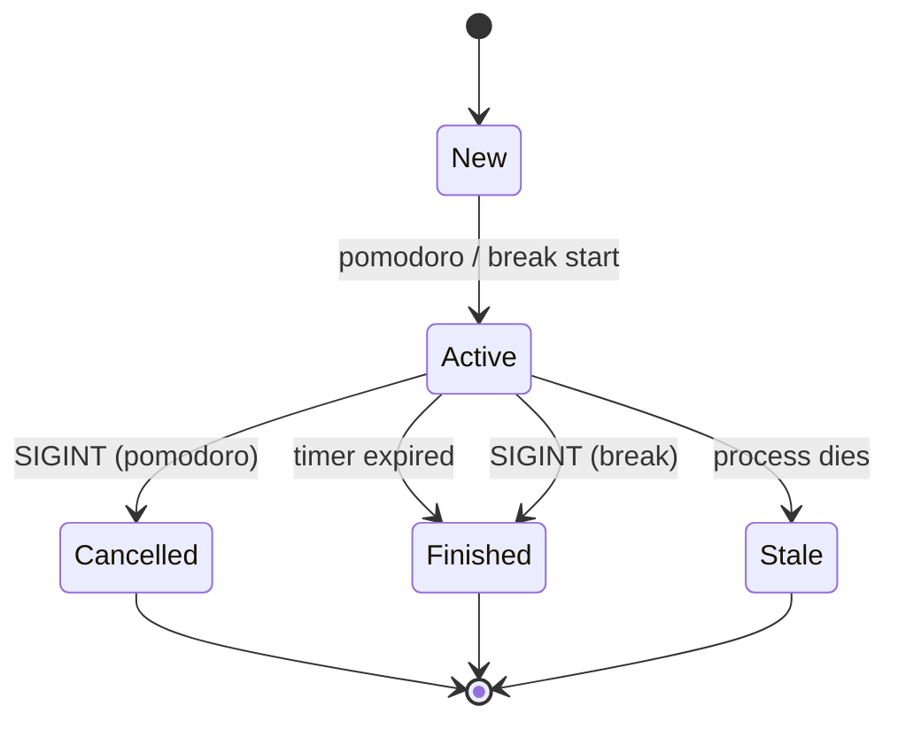

Simple [Pomodoro](https://en.wikipedia.org/wiki/Pomodoro_Technique) timer written in Rust

# Usage

```command
$ rustomato pomodoro [start]         # Starts a new Pomodoro. Auto-finishes the currently active break if there is one.
$ rustomato pomodoro interrupt       # Records an interruption on the active (or most recently finished) Pomodoro.
$ rustomato pomodoro annotate <text> # Annotates the active, or the most recently completed, Pomodoro with the given text.
$ rustomato pomodoro log             # Log an externally completed pomodoro.
$ rustomato break start              # Starts a break. Auto-finishes the currently active Pomodoro if there is one.
```

`pomodoro` and `break` will block until the time is over. If the command is interrupted with Control-C (`SIGINT`), the currently running Pomodoro is cancelled immediately. If a break is currently running, it is finished.

# Rule #1

There must never be more than one pomodoro [XOR](http://en.wikipedia.org/wiki/Xor) break at any given time.

This is scoped to an instance of the database (as pointed to by `$RUSTOMATO_DATABASE_URL`). The enforcement happens at the database level via a trigger that rejects overlapping time ranges, and at the application level in the scheduler.

# State Transitions


```mermaid
stateDiagram-v2
    [*] --> New
    New --> Active : pomodoro / break start
    Active --> Finished : timer expired
    Active --> Cancelled : SIGINT (pomodoro)
    Active --> Finished : SIGINT (break)
    Active --> Stale : process dies
    Cancelled --> [*]
    Finished --> [*]
    Stale --> [*]
```

The possible application states are valid for an instance of the database (as pointed to by `$RUSTOMATO_DATABASE_URL`, which defaults to `$RUSTOMATO_ROOT/data.db`). The default for `$RUSTOMATO_ROOT` is `$HOME/.rustomato`.

The key difference between a pomodoro and a break is how they respond to interruptions and cancellation:

* a pomodoro can be interrupted (keeping it running) or cancelled (via SIGINT), whereas
* a break is simply finished — it does not accept interruptions and SIGINT finishes it rather than cancelling it.

# Hooks

Rustomato can run user-provided scripts — **hooks** — at key state transitions. Hooks live in `$RUSTOMATO_ROOT/hooks/` and are looked up by exact filename.

## Quick start

```sh
rustomato init
```

This creates the `hooks/` directory (inside `$RUSTOMATO_ROOT`) with executable sample scripts for every hook. Each script exits `0` and does nothing by default.

## Available hooks

| Hook | Fires | Can abort? |
|---|---|---|
| `before-start-pomodoro` | Before a pomodoro starts | yes |
| `after-start-pomodoro` | After a pomodoro started | no |
| `before-finish-pomodoro` | Pomodoro timer expired | yes |
| `after-finish-pomodoro` | Pomodoro finished | no |
| `before-cancel-pomodoro` | Ctrl-C during a pomodoro | yes |
| `after-cancel-pomodoro` | Pomodoro cancelled | no |
| `before-interrupt-pomodoro` | Before an interrupt is recorded | yes |
| `after-interrupt-pomodoro` | Interrupt recorded | no |
| `before-annotate-pomodoro` | Before an annotation is added | yes |
| `after-annotate-pomodoro` | Annotation added | no |
| `before-log-pomodoro` | Before an external pomodoro is logged | yes |
| `after-log-pomodoro` | External pomodoro logged | no |
| `before-start-break` | Before a break starts | yes |
| `after-start-break` | After a break started | no |
| `before-finish-break` | Break timer expired or Ctrl-C | yes |
| `after-finish-break` | Break finished | no |

## How hooks are invoked

Rustomato executes the hook file directly using the OS `execve`-equivalent, which means the file must be an executable with a valid shebang line or a binary. Any language works:

```sh
#!/usr/bin/env bash
# …
exit 0
```

```python
#!/usr/bin/env python3
import sys
sys.exit(0)
```

Hooks that do not have the executable bit (`+x`) set are silently skipped (shown in `--verbose` mode).

## Exit code semantics

- **`before-*` hooks**: exit `0` to allow the operation to proceed. Any non-zero exit **aborts** the operation, and rustomato exits non-zero itself.
- **`after-*` hooks**: the operation has already completed. A non-zero exit is logged as a warning (in `--verbose` mode) but has no effect on the operation.

## What hooks receive

**First argument (`$1`):** the hook name, e.g. `before-start-pomodoro`.
This lets a single script dispatch on the hook name if desired.

**Environment variables** (set for every hook):

| Variable | Example | Description |
|---|---|---|
| `RUSTOMATO_ROOT` | `/Users/me/.rustomato` | Rustomato data directory |
| `RUSTOMATO_HOOK` | `before-start-pomodoro` | The hook being run |
| `RUSTOMATO_KIND` | `pomodoro` | `pomodoro` or `break` |
| `RUSTOMATO_UUID` | `967a14ee45da44a49049794aeea7c292` | Unique identifier |
| `RUSTOMATO_DURATION` | `25` | Duration in minutes |
| `RUSTOMATO_STARTED_AT` | `1748464846` | Unix timestamp of start |
| `RUSTOMATO_FINISHED_AT` | `1748464864` | Unix timestamp (after-* only) |
| `RUSTOMATO_CANCELLED_AT` | `1748464864` | Unix timestamp (after-* only) |
| `RUSTOMATO_INTERRUPT_KIND` | `internal` | Kind of interrupt (`internal` or `external`; interrupt hooks only) |
| `RUSTOMATO_INTERRUPTIONS` | `2` | Total interruption count on this schedulable (interrupt hooks only) |

## Timeout

A hook that runs longer than **3 seconds** is killed (`SIGKILL`). This prevents a misbehaving or hanging hook from blocking the timer.

The timeout can be changed via the `RUSTOMATO_HOOK_TIMEOUT` environment variable (value in milliseconds):

```sh
# Give hooks 10 seconds instead of 3
export RUSTOMATO_HOOK_TIMEOUT=10000
```

## Security

- Only files **inside** `$RUSTOMATO_ROOT/hooks/` are ever executed.
- Only files with the **executable bit** (`+x`) are invoked; stray files are silently ignored.
- Hooks run with the same privileges as the `rustomato` process (typically the current user).
- Use the `--no-hooks` flag to disable all hooks in case a broken hook prevents normal operation:

  ```sh
  rustomato --no-hooks pomodoro start
  ```

## Examples

**Desktop notification when a pomodoro finishes** (`after-finish-pomodoro`):

```sh
#!/usr/bin/env bash
terminal-notifier -message "Pomodoro is over" \
                  -title rustomato    \
                  -sound glass        \
                  -group rustomato
exit 0
```

**Prevent starting a pomodoro after a certain hour** (`before-start-pomodoro`):

```sh
#!/usr/bin/env bash
if [ "$(date +%H)" -ge 22 ]; then
  echo "No pomodori after 10 PM!"
  exit 1
fi
exit 0
```

**Log cancelled pomodori to a file** (`after-cancel-pomodoro`):

```sh
#!/usr/bin/env bash
echo "$RUSTOMATO_STARTED_AT Cancelled $RUSTOMATO_KIND $RUSTOMATO_UUID" \
  >> "$HOME/.rustomato_cancellations"
exit 0
```

# Interrupts

When you call `rustomato pomodoro interrupt`, the current pomodoro's interruption counter is incremented by one. The pomodoro **continues running** -- an interrupt does not cancel or finish it.

If no pomodoro is active but a break is running, the interruption is recorded on the most recently finished pomodoro.

Interrupt hooks receive two additional environment variables:

| Variable | Example | Description |
|---|---|---|
| `RUSTOMATO_INTERRUPT_KIND` | `internal` | `internal` or `external` |
| `RUSTOMATO_INTERRUPTIONS` | `3` | Total interruption count on this pomodoro |

Use `--kind internal` (default) or `--kind external` to classify the interruption. Internal interruptions are self-inflicted (e.g. checking your phone); external ones are caused by the environment (e.g. a colleague knocking).

# Installation

## Homebrew

```sh
brew install suhlig/tap/rustomato
```

This formula automatically installs shell completions for bash, zsh, and fish.

## Manual

| File | Architecture | Typical Hardware |
|---|---|---|
| `rustomato-linux-amd64.tar.gz` | x86_64 | Desktop PCs, laptops |
| `rustomato-linux-arm64.tar.gz` | ARM 64-bit | Raspberry Pi 3/4/5 (64-bit OS) |
| `rustomato-linux-armv7.tar.gz` | ARM 32-bit | Raspberry Pi 2/3/4/5 (32-bit OS) |
| `rustomato-darwin-amd64.tar.gz` | x86_64 | Intel Macs |
| `rustomato-darwin-arm64.tar.gz` | ARM 64-bit | Apple Silicon Macs |

**Linux**

```sh
arch=$(uname -m | sed 's/x86_64/amd64/;s/aarch64/arm64/;s/armv7l/armv7/') && curl -sL "https://github.com/suhlig/rustomato/releases/latest/download/rustomato-linux-${arch}.tar.gz" | tar xz && sudo mv rustomato /usr/local/bin
```

# Releasing

> Requires [git-cliff](https://git-cliff.org) (e.g. `brew install git-cliff`) and [cargo-release](https://github.com/crate-ci/cargo-release) (`cargo install cargo-release`)

Cut a new release with a single command:

```sh
cargo release patch --execute # or `minor`, or `major`
```

This will:
- Choose the next version by bumping the current one (`patch` → `0.0.11`, `minor` → `0.1.0`, …)
- Run `git cliff` to prepend the new changelog entry to `CHANGELOG.md`
- Bump the version in `Cargo.toml`
- Commit both files together
- Create a git tag (e.g. `v0.0.11`)
- Push the commit and tag to GitHub, where `release.yml` builds and publishes the artifacts

To preview without making changes, do not specify `--execute`:

```sh
cargo release patch
```

# Development

* Install and update rust with `rustup`
* Run tests with `cargo test`
  - use `cargo watch -x test` for fast iteration
  - install the plugin with `cargo install cargo-watch`
* Run the app: `cargo run -- pomodoro`
* Run `pre-commit install` to install the pre-commit hook

# TODO

* `rustomato pomodoro annotate --target <GUID>` adds an annotation to the pomodoro with the given GUID.
  - When the symbolic `--target -1` is specified, the annotation is added to the most recent pomodoro (i.e. the one that was most recently completed). Extend that pattern to `-2` until `-9` for the most recent pomodori, even if they were earlier than today.
  - When the argument to `--target` can be interpreted as a timestamp that falls into one of the most recent pomodori, the annotation is added to that pomodoro.
* Show progress bar only when attached to a terminal
  - Should we make this a full TUI using Ratatui? Where does it end?
  - Also need to react to SIGWINCH to resize the progress bar
  - Shall we also print times elapsed and remaining?
* Does a CSV export of pomodori and breaks make sense for externally created reports?
