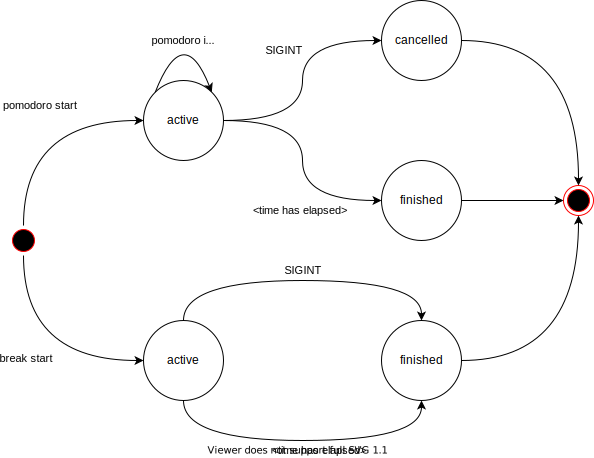

I am learning Rust by implementing a simple [Pomodoro](https://en.wikipedia.org/wiki/Pomodoro_Technique) timer.

# Usage

```command
$ rustomato pomodoro [start]   # Starts a new Pomodoro. Auto-finishes the currently active break if there is one.
$ rustomato pomodoro annotate  # Annotates a¹ Pomodoro.
$ rustomato pomodoro interrupt # Mark a¹ Pomodoro as interrupted.
$ rustomato pomodoro log       # Log a previously finished pomodoro.
$ rustomato break [start]      # Starts a break. Auto-finishes the currently active Pomodoro if there is one.
```
[1] the running, if there is one, or the most recently completed, or the given

`pomodoro` and `break` will block until the time is over. If the command is interrupted with Control-C (`SIGINT`), the currently running Pomodoro is cancelled immediately. If a break is currently running, it is finished.

The possible application states are valid for an instance of the database (as pointed to by `$RUSTOMATO_DATABASE_URL`, which defaults to `$RUSTOMATO_ROOT/data.db`):

  

The default for `$RUSTOMATO_ROOT` is `$HOME/.rustomato`.

## Hooks

> WIP - look at https://github.com/crate-ci/cargo-release/blob/master/src/cmd.rs for an example

Until we have them, here is how to use notifications:

```command
$ rustomato pomodoro start && terminal-notifier -message "Pomodoro is over" -title rustomato -sound glass -group rustomato || terminal-notifier -message "Pomodoro cancelled" -title rustomato -sound glass -group rustomato
```

If you prefer tmux:

```command
$ rustomato pomodoro start && tmux display-message "Pomodoro is over" || tmux display-message "Pomodoro cancelled"
```

Or, on a Mac:

```command
$ rustomato pomodoro start && say "Pomodoro is over" || say "Pomodoro cancelled"
```

# Release

There is a Concourse pipeline in `ci`. It releases every tag. Note that this needs `git push --follow-tags`.

# Development

* Install and update rust with `rustup`
* Run tests with `cargo test`
  - use `cargo watch -x test` for fast iteration
  - install the plugin with `cargo install cargo-watch`
* Run the app: `cargo run -- pomodoro`
* Build a release manually with `cargo build --release` (binary will be found in `target/release/`)

# TODO

* `--force`
* `rustomato pomodoro annotate [WORDS]` adds an annotation to
  - the currently running `rustomato` process,
  - if no process or a break is currently running, amend the most recent pomodoro, or the one given with `--pomodoro UUID`
  - needs `annotations` table, joined onto `schedulables`
  - if no `WORDS` are given, they are taked from `STDIN`
* `rustomato pomodoro interrupt --external | --internal` marks the currently running Pomodoro as interrupted
  - technically, an interrupt is an annotation that is of kind `external-interrupt` or `internal-interrupt`
* Show progress bar only when attached to a terminal
* Use [cargo release](https://github.com/crate-ci/cargo-release) or, at least, manually verify that the git tag is the same as `cargo metadata --no-deps --format-version 1 | jq --raw-output '.packages[] | select(.targets[].kind[] | contains("bin")) | .version'`
*
